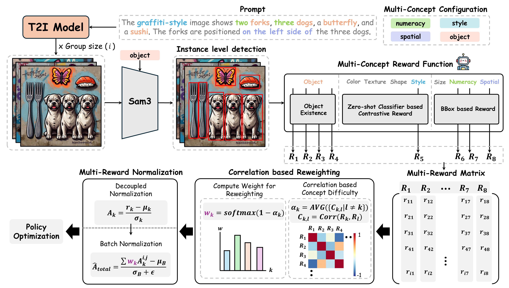
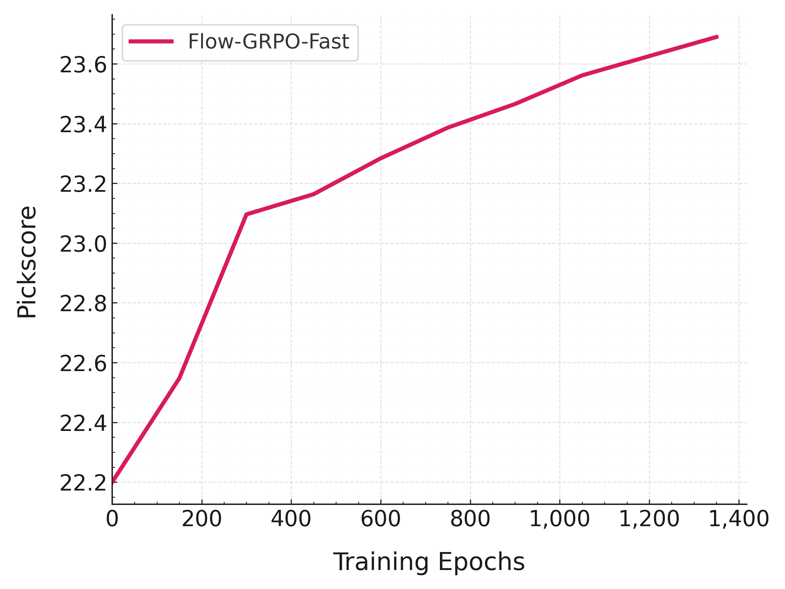
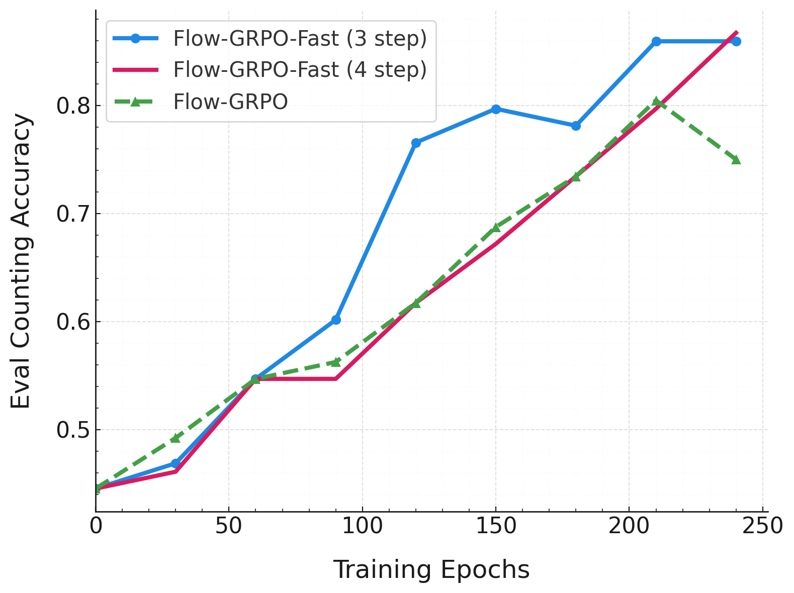
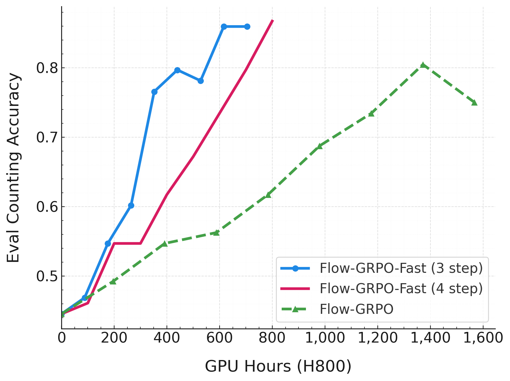
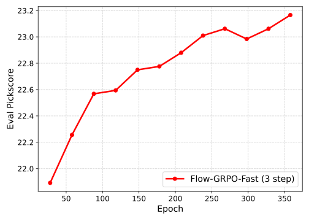

<h1 align="center"> Correlation-Weighted Multi-Reward Optimization<br>for Compositional Generation </h1>

<div align="center">

<br>

<p>
  Jungmyung Wi<sup>1</sup>, Hyunsoo Kim<sup>1</sup>, and Donghyun Kim<sup>1&dagger;</sup><br>
  <sup>1</sup>Korea University
</p>

<a href="https://arxiv.org/abs/2603.18528"></a>
<a href="https://thedarkknight-21th.github.io/CMO/"></a>
<a href="https://github.com/TheDarkKnight-21th/CMO/tree/main"></a>
<a href="https://huggingface.co/collections/Bruece/cmo"></a>
</div>

## Introduction

<p align="center">
  
</p>


**Correlation-Weighted Multi-Reward Optimization (CMO)** is a reward optimization framework for improving **compositional text-to-image generation**. Instead of simply averaging multiple concept rewards, CMO analyzes the **correlation structure** among concept-wise rewards and adaptively assigns higher weights to **conflicting concepts**. CMO decomposes complex prompts into fine-grained rewards, including **object existence**, **attributes**, **numeracy**, **size**, and **spatial relations**, enabling diffusion models to better satisfy multiple concepts simultaneously. Our method is applied to **SD3.5** and **FLUX.1-dev**, achieving strong improvements on challenging compositional benchmarks such as **ConceptMix**, **GenEval 2**, and **T2I-CompBench**. This work has been **accepted** to the **European Conference on Computer Vision (ECCV 2026)**.

## 🤗 Model
| Model | Hugging Face |
| -------- | -------- |
| FLUX.1-dev-CMO | [🤗 Bruece/FLUX.1-dev-CMO](https://huggingface.co/Bruece/FLUX.1-dev-CMO) |
| FLUX.1-dev-CMO-HPSv2 | [🤗 Bruece/FLUX.1-dev-CMO-HPSv2](https://huggingface.co/Bruece/FLUX.1-dev-CMO-HPSv2) |
| SD3.5-dev-CMO | 🚧 Coming Soon |

`FLUX.1-dev-CMO-HPSv2` is the CMO-trained FLUX.1-dev model variant that additionally emphasizes HPSv2-based human preference alignment.


## 🚀 Quick Started
### 1. Environment Set Up
Clone this repository and install packages.
```bash
git clone https://github.com/yifan123/flow_grpo.git
cd flow_grpo
conda create -n flow_grpo python=3.10.16
pip install -e .
```

### 2. Model Download
To avoid redundant downloads and potential storage waste during multi-GPU training, please pre-download the required models in advance.

**Models**
* **SD3.5**: `stabilityai/stable-diffusion-3.5-medium`
* **Flux**: `black-forest-labs/FLUX.1-dev`

**Reward Models**
* **PickScore**:
  * `laion/CLIP-ViT-H-14-laion2B-s32B-b79K`
  * `yuvalkirstain/PickScore_v1`
* **CLIPScore**: `openai/clip-vit-large-patch14`
* **Aesthetic Score**: `openai/clip-vit-large-patch14`
* **CMO/Ours reward**:
  * `facebook/sam3` for object detection and segmentation
  * `ViT-H-14` with `laion2b_s32b_b79k` through OpenCLIP for color, texture, shape, and style scoring
  * `depth-anything/da3-small` for front/behind spatial relations
  * HPSv2.1 checkpoint for prompt-image preference scoring


### 3. Reward Preparation
The steps above only install the current repository. Since each reward model may rely on different versions, combining them in one Conda environment can cause version conflicts. To avoid this, we adopt a remote server setup inspired by ddpo-pytorch. You only need to install the specific reward model you plan to use.

#### GenEval
Please create a new Conda virtual environment and install the corresponding dependencies according to the instructions in the local [`reward-server/`](reward-server/) directory.

#### OCR
Please install paddle-ocr:
```bash
pip install paddlepaddle-gpu==2.6.2
pip install paddleocr==2.9.1
pip install python-Levenshtein
```
Then, pre-download the model using the Python command line:
```python
from paddleocr import PaddleOCR
ocr = PaddleOCR(use_angle_cls=False, lang="en", use_gpu=False, show_log=False)
```

#### Pickscore
PickScore requires no additional installation. Note that the original [pickscore](https://huggingface.co/datasets/yuvalkirstain/pickapic_v1) dataset corresponds to `dataset/pickscore` in this repository, containing some NSFW prompts. We strongly recommend using [pickapic\_v1\_no\_images\_training\_sfw](https://huggingface.co/datasets/CarperAI/pickapic_v1_no_images_training_sfw), the SFW version of the Pick-a-Pic dataset, which corresponds to `dataset/pickscore_sfw` in this repository.

#### DeQA
Please create a new Conda virtual environment and install the corresponding dependencies according to the instructions in the local [`reward-server/`](reward-server/) directory.

#### CMO / Ours Reward
CMO reward calculation must run in a separate Conda environment from the main training environment. The server-side code is in the local [`reward-server/`](reward-server/) directory, and the `ours` reward is implemented by `reward-server/app_ours.py` and `reward-server/reward_server/ours.py`. It combines object-level compositional rewards and a prompt-image preference reward:

* SAM3 detects and segments objects from each object name in the refined metadata.
* OpenCLIP scores visual attributes: `color`, `texture`, `shape`, and `style`.
* Count and size rewards are computed from detected object counts and box areas.
* Spatial rewards cover `left`, `right`, `top`/`above`, `bottom`/`below`, `inside`, `outside`, `in front of`, and `behind`; depth-based relations use Depth Anything V3.
* HPSv2 is appended as the final global prompt-image reward.

Install the CMO reward-server dependencies in their own environment by following [`reward-server/README.md`](reward-server/README.md). Use the latest stable PyTorch build that matches your CUDA driver; do not reuse the older GenEval/MMDetection environment for CMO reward calculation.

Before launching the server, check the local paths in `reward-server/reward_server/ours.py`:

* `attribute_dir` should point to the ConceptMix attribute config directory, e.g. `assets/conceptmix_config` in this repository.
* The HPSv2 paths should point to `open_clip_pytorch_model.bin` and `HPS_v2.1_compressed.pt` on your machine.

Launch the reward server with:

```bash
cd reward-server
conda activate reward_server_cmo
python app_ours.py
```

The server expects a pickled payload with `images`, `meta_datas`, and `prompts`, and returns `reward_tensors`, `detailed_object_rewards`, and `detailed_spatial_scores`. In the training code, use `config.reward_fn = {"ours": 1.0}` with `config.prompt_fn = "ours"` or `"ours_geneval"`.

#### UnifiedReward
Since `sglang` may conflict with other environments, we recommend creating a new conda environment.
```bash
conda create -n sglang python=3.10.16
conda activate sglang
pip install "sglang[all]"
```
We use sglang to deploy the reward service. After installing sglang, please run the following command to launch UnifiedReward:
```bash
python -m sglang.launch_server --model-path CodeGoat24/UnifiedReward-7b-v1.5 --api-key flowgrpo --port 17140 --chat-template chatml-llava --enable-p2p-check --mem-fraction-static 0.85
```
#### ImageReward
Please install imagereward:
```bash
pip install image-reward
pip install git+https://github.com/openai/CLIP.git
```
### 4. Inference

Below is the code to load and merge the LoRA adapter with the base FLUX.1-dev model.

```python
import torch
from diffusers import FluxPipeline
from peft import PeftModel


model_id = "black-forest-labs/FLUX.1-dev"
lora_ckpt_path = "Bruece/FLUX.1-dev-CMO"
device = "cuda"


pipe = FluxPipeline.from_pretrained(model_id, torch_dtype=torch.bfloat16)
pipe.transformer = PeftModel.from_pretrained(pipe.transformer, lora_ckpt_path)
pipe.transformer = pipe.transformer.merge_and_unload()
pipe = pipe.to(device)


prompt = 'a photo of a black kite and a green bear'
image = pipe(prompt, height=512, width=512, num_inference_steps=40, guidance_scale=3.5).images[0]
image.save("flux_cmo_lora.png")
```

### 5. Start Training

#### CMO / Ours

Start the CMO reward server first in the dedicated reward environment:

```bash
cd reward-server
conda activate reward_server_cmo
python app_ours.py
```

Then launch CMO training from the repository root in the main training environment:

```bash
# SD3.5 fast CMO training
bash scripts/single_node/grpo_sd3_fast.sh

# FLUX fast CMO training
bash scripts/single_node/grpo_flux_fast_ours.sh
```

These scripts use the `ours` reward configuration and expect the reward server to be reachable while training is running.

#### GRPO


**Single-node training**

```bash
# sd3
bash scripts/single_node/grpo.sh
# flux
bash scripts/single_node/grpo_flux.sh
```

---

<details> <summary>Multi-node training for SD3:</summary>

```bash
# Master node
bash scripts/multi_node/sd3.sh 0
# Other nodes
bash scripts/multi_node/sd3.sh 1
bash scripts/multi_node/sd3.sh 2
bash scripts/multi_node/sd3.sh 3
```
---
</details>


<details> <summary>Multi-node training for FLUX.1-dev</summary>

```bash
# Master node
bash scripts/multi_node/flux.sh 0
# Other node
bash scripts/multi_node/flux.sh 1
bash scripts/multi_node/flux.sh 2
bash scripts/multi_node/flux.sh 3
```
For Flow-GRPO-Fast, please use `scripts/multi_node/flux_fast.sh`. See the W&B logs for [Geneval](https://api.wandb.ai/links/ljie/qz47q208) (with `geneval_flux_fast` in the config) and [PickScore](https://api.wandb.ai/links/ljie/ncdwa0wo) (with `pickscore_flux_fast` in the config).

---
</details>


<details> <summary>Multi-node training for FLUX.1-Kontext-dev</summary>

Please first download [generated\_images.zip](https://huggingface.co/datasets/jieliu/counting_edit/blob/main/generated_images.zip) and extract it into the `counting_edit` directory. You can also use the scripts in the `counting_edit` directory to generate the data yourself.

Please install `diffusers` from the main branch to support `FLUX.1-Kontext-dev`:
```bash
pip install git+https://github.com/huggingface/diffusers.git
```
After upgrading Diffusers, some packages such as PEFT may also need to be upgraded. If you encounter any errors, please upgrade them according to the error messages.
Then, run the scripts:
```bash
# Master node
bash scripts/multi_node/flux_kontext.sh 0
# Other nodes
bash scripts/multi_node/flux_kontext.sh 1
bash scripts/multi_node/flux_kontext.sh 2
bash scripts/multi_node/flux_kontext.sh 3
```
---
</details>


<details> <summary>Multi-node training for Qwen-Image:</summary>

In the implementation of Qwen-Image, we have unified Flow-GRPO and Flow-GRPO-Fast. You can control the size of the SDE window with `config.sample.sde_window_size`, and adjust the position of the window with `config.sample.sde_window_range`.

Please install `diffusers` from the main branch to support `Qwen-Image`:
```bash
pip install git+https://github.com/huggingface/diffusers.git
```
Then run the scripts:
```bash
# Master node
bash scripts/multi_node/qwenimage.sh 0
# Other nodes
bash scripts/multi_node/qwenimage.sh 1
bash scripts/multi_node/qwenimage.sh 2
bash scripts/multi_node/qwenimage.sh 3
```
Using the provided configuration, the resulting reward curve of Qwen-Image on the test set is shown below.

<p align="center">
  
</p>
---
</details>


<details> <summary>Multi-node training for Qwen-Image-Edit:</summary>

Same as Flux Kontext, please first download [generated\_images.zip](https://huggingface.co/datasets/jieliu/counting_edit/blob/main/generated_images.zip) and extract it into the `counting_edit` directory. You can also use the scripts in the `counting_edit` directory to generate the data yourself.

Please install `diffusers` from the main branch to support `Qwen-Image-Edit`:
```bash
pip install git+https://github.com/huggingface/diffusers.git
```
Then run the scripts:
```bash
# Master node
bash scripts/multi_node/qwenimage_edit.sh 0
# Other nodes
bash scripts/multi_node/qwenimage_edit.sh 1
bash scripts/multi_node/qwenimage_edit.sh 2
bash scripts/multi_node/qwenimage_edit.sh 3
```

Using the provided configuration, the resulting reward curve of Qwen-Image-Edit on the test set is shown below.

<p align="center">
  
   
</p>
---
</details>


<details> <summary>Multi-node training for Bagel:</summary>

Please first upgrade `transformers` to **version>=4.44.0** install `flash-attn`:
```bash
pip install transformers==4.44.0
pip install flash-attn==2.7.4.post1 --no-build-isolation
```

Then run the scripts:
```bash
# Master node
bash scripts/multi_node/bagel/main.sh 0
# Other nodes
bash scripts/multi_node/bagel/main.sh 1
bash scripts/multi_node/bagel/main.sh 2
bash scripts/multi_node/bagel/main.sh 3
```

Using the provided configuration, the resulting reward(PickScore) curve of Bagel on the test set is shown below (with 32 GPU).

<p align="center">
  
</p>

**[Note]: About resource requirements & OOM**

The default training script adopts full-parameter mode, whcih requires at least **8 × 80GB GPUs**. If you encounter OOM issues, you can switch to LoRA training with the config provided in `config/grpo.py:pickscore_bagel_lora`.

---
</details>


#### DPO / OnlineDPO / SFT / OnlineSFT
 Single-node training:
```bash
bash scripts/single_node/dpo.sh
bash scripts/single_node/sft.sh
```
Multi-node training:

Please update the entry Python script and config file names in the `scripts/multi_node` bash file.


## FAQ

* Please use **fp16** for training whenever possible, as it provides higher precision than bf16, resulting in smaller log-probability errors between data collection and training. For Flux and Wan, becauase fp16 inference cannot produce valid images or videos, you will have to use **bf16** for training. Note that log-probability errors tend to be smaller at high-noise steps and larger at low-noise steps. Training only on high-noise steps yields better results in this case. Thanks to [Jing Wang](https://scholar.google.com.hk/citations?user=Q9Np_KQAAAAJ&hl=zh-CN) for these observations.

* When using **Flow-GRPO-Fast**, set a relatively small `clip_range`, otherwise training may crash.

* When implementing a new model, please check whether using different batch sizes leads to slight differences in the output. SD3 has this issue, which is why I ensure that the batch size for training is the same as that used for data collection.


## How to Support Other Models

To integrate a new model into this framework, please follow the steps below:

**1. Add the following files adapted for your model:**

* `flow_grpo/diffusers_patch/sd3_pipeline_with_logprob.py`:
  This file is adapted from [pipeline\_stable\_diffusion\_3.py](https://github.com/huggingface/diffusers/blob/main/src/diffusers/pipelines/stable_diffusion_3/pipeline_stable_diffusion_3.py). You can refer to diffusers for your model.

* `scripts/train_sd3.py`:
  This script is based on [train\_dreambooth\_lora\_sd3.py](https://github.com/huggingface/diffusers/blob/main/examples/dreambooth/train_dreambooth_lora_sd3.py) from the DreamBooth examples.

* `flow_grpo/diffusers_patch/sd3_sde_with_logprob.py`:
  This file handles SDE sampling. In most cases, you don't need to modify it. However, if your definitions of `dt` or `velocity` differ in sign or convention, please adjust accordingly.

**2. Verify SDE sampling:**
Set `noise_level = 0` in [sde\_demo.py](https://github.com/yifan123/flow_grpo/tree/main/scripts/demo/sd3_sde_demo.py) to check whether the generated images look normal. This helps verify that your SDE implementation is correct.

**3. Ensure on-policy consistency:**
Set [`config.sample.num_batches_per_epoch = 1`](https://github.com/yifan123/flow_grpo/blob/main/config/grpo.py#L120) and [`config.train.gradient_accumulation_steps = 1`](https://github.com/yifan123/flow_grpo/blob/main/config/grpo.py#L125C5-L125C47) to enforce a purely on-policy setup, where the model collecting samples is identical to the one being trained.
Under this setting, the [ratio](https://github.com/yifan123/flow_grpo/blob/main/scripts/train_sd3.py#L886) should remain exactly 1. If it's not, please check whether the sampling and training code paths differ—for example, through use of `torch.compile` or other model wrappers—and make sure both share the same logic.

**4. Tune reward behavior:**
Start with `config.train.beta = 0` to observe if the reward increases during training. You may also need to adjust the noise level [here](https://github.com/yifan123/flow_grpo/blob/main/flow_grpo/diffusers_patch/sd3_sde_with_logprob.py#L47) based on your model. Other hyperparameters are generally model-agnostic and can be kept as default.


## 🏁 Multi Reward Training
For scalar multi-reward settings, pass a dictionary where each key is a reward name and each value is its weight. The final reward is a weighted sum of the individual scalar rewards:

```python
{
    "pickscore": 0.5,
    "ocr": 0.2,
    "aesthetic": 0.3
}
```

For CMO, use the `ours` reward key. It returns an attribute-level reward tensor rather than a single scalar score, and the CMO training scripts consume that tensor directly:

```python
{
    "ours": 1.0
}
```

The following reward models are currently supported:
* **CMO/Ours** (`ours`) returns an attribute-level reward tensor for compositional generation. It scores object existence, number, size, visual attributes, spatial relations, and HPSv2 prompt-image preference.
* **Geneval** evaluates T2I models on complex compositional prompts.
* **OCR** provides an OCR-based reward.
* **PickScore** is a general-purpose T2I reward model trained on human preferences.
* **[DeQA](https://github.com/zhiyuanyou/DeQA-Score)** is a multimodal LLM-based image quality assessment model that measures the impact of distortions and texture damage on perceived quality.
* **ImageReward** is a general-purpose T2I reward model capturing text-image alignment, visual fidelity, and safety.
* **QwenVL** is an experimental reward model using prompt engineering.
* **Aesthetic** is a CLIP-based linear regressor predicting image aesthetic scores.
* **JPEG\_Compressibility** measures image size as a proxy for quality.
* **UnifiedReward** is a state-of-the-art reward model for multimodal understanding and generation, topping the human preference leaderboard.

        
## ✨ Important Hyperparameters
You can adjust the parameters in `config/grpo.py` to tune different hyperparameters. An empirical finding is that `config.sample.train_batch_size * num_gpu / config.sample.num_image_per_prompt * config.sample.num_batches_per_epoch = 48`, i.e., `group_number=48`, `group_size=24`.
Additionally, setting `config.train.gradient_accumulation_steps = config.sample.num_batches_per_epoch // 2`.

## 🤗 Acknowledgement
This project is built on top of [Flow-GRPO](https://github.com/yifan123/flow_grpo), which is based on [ddpo-pytorch](https://github.com/kvablack/ddpo-pytorch) and [diffusers](https://github.com/huggingface/diffusers); we thank the authors for their valuable contributions to the AIGC community, with special thanks to Kevin Black for the excellent *ddpo-pytorch* repo.

## ⭐Citation
If you find CMO useful for your research or projects, we would greatly appreciate it if you could cite the following paper:
```
@article{wi2026correlation,
  title={Correlation-Weighted Multi-Reward Optimization for Compositional Generation},
  author={Wi, Jungmyung and Kim, Hyunsoo and Kim, Donghyun},
  journal={arXiv preprint arXiv:2603.18528},
  year={2026}
}
```
